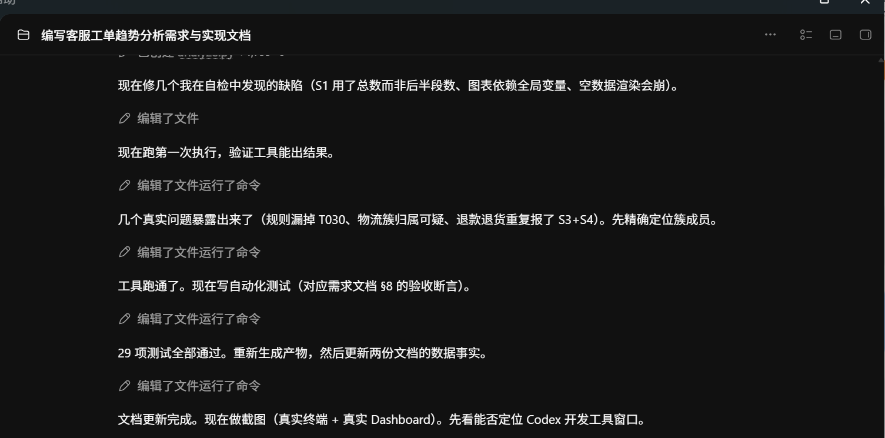
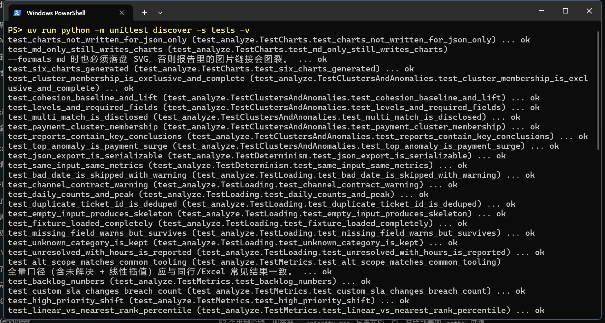
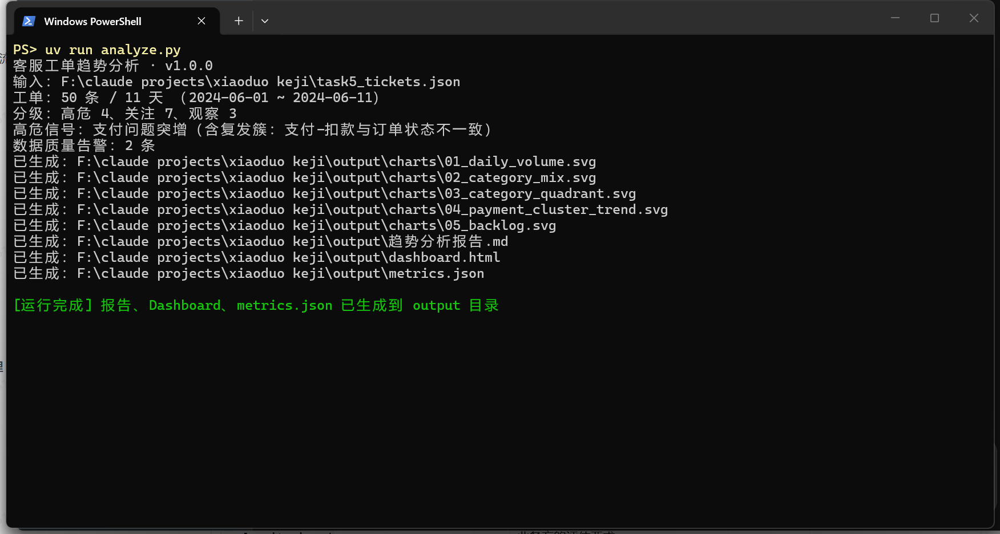
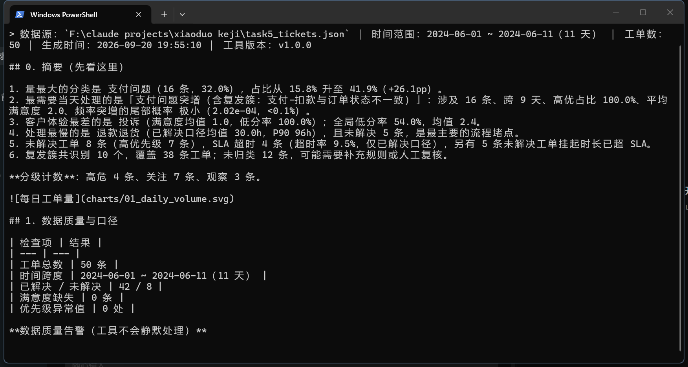
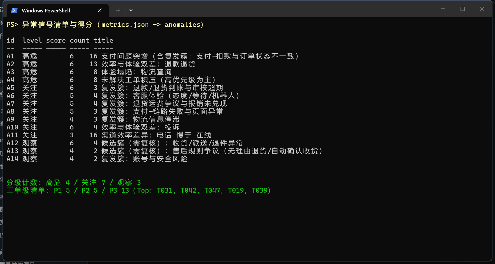
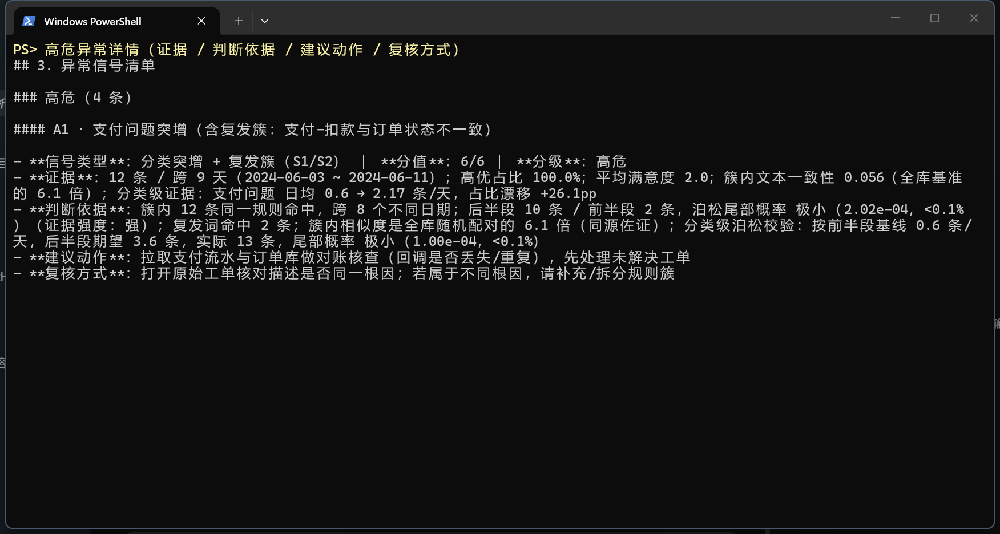
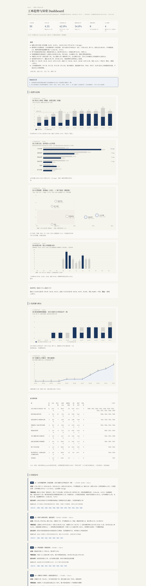

# 客服工单趋势分析工具（任务 0111）

[](https://github.com/think520/xiaoduo-0111-ticket-trend/actions/workflows/tests.yml)
[](https://github.com/think520/xiaoduo-0111-ticket-trend/actions/workflows/deploy-pages.yml)

> **只想快速了解？** 看 [SUBMISSION.md](SUBMISSION.md)：30 秒结论 + 交付物索引 + 截图索引 + 要求对照 + 自评。

把"人工翻工单列表"变成**结构化趋势报告 + 可复核的异常清单**：主管只负责判断，机器负责算分布、算变化、找复发。

**一句话定义**：零第三方依赖的 Python 工具，读取工单数据（JSON/CSV），输出 Markdown 报告 + 自包含 HTML Dashboard + 机器可读指标，并且**每一条异常都带证据、判断依据、建议动作和复核方式**。

---

## 快速开始

```bash
# 1) 分析（默认读脚本同目录的 task5_tickets.json，写到 output/）
uv run analyze.py

# 2) 跑验收测试（45 个用例，零依赖 unittest）
uv run python -m unittest discover -s tests -v

# 3) 换 SLA 假设或换输入（示例）
uv run analyze.py --input data/tickets.csv --outdir out --sla 高=12,中=24,低=48

# 4) 严格校验模式：字段类型/取值不合契约时直接报错退出（默认宽松告警并继续）
uv run analyze.py --strict
```

**在线 Demo**：<https://think520.github.io/xiaoduo-0111-ticket-trend/>（GitHub Pages，内容与 `output/dashboard.html` 一致）

产物：

| 文件 | 内容 |
| --- | --- |
| `output/趋势分析报告.md` | 摘要 → 数据质量 → 9 个维度 → 异常清单 → 工单级清单 → 方法与局限 → 附录 |
| `output/dashboard.html` | 自包含单文件（内联 CSS/SVG、无 JS、无 CDN），双击即可看 KPI 卡 / 6 张图 / 异常卡 / 明细表 |
| `output/metrics.json` | 全部指标与异常的结构化结果，供复核与二次开发 |
| `output/charts/*.svg` | 6 张矢量图，可直接嵌入 Markdown / PPT |

> 实测运行时间 < 1 秒；同一输入重复运行结果完全一致（有测试保证），唯一变化的是 `generated_at` 时间戳。

---

## 交付物清单

| 类别 | 文件 |
| --- | --- |
| 代码 | [`analyze.py`](analyze.py)（单文件：加载/校验/指标/簇/工单级评分/SVG/渲染）、[`tests/test_analyze.py`](tests/test_analyze.py)（45 个用例）、[`.github/workflows/deploy-pages.yml`](.github/workflows/deploy-pages.yml) |
| 文档 | [`SUBMISSION.md`](SUBMISSION.md)（提交速览）、[`docs/01-需求文档.md`](docs/01-需求文档.md)、[`docs/02-实现文档.md`](docs/02-实现文档.md)、本 README |
| CI | [`.github/workflows/tests.yml`](.github/workflows/tests.yml)（3 个 Python 版本 × 产物/结论/退出码校验）、[`.github/workflows/deploy-pages.yml`](.github/workflows/deploy-pages.yml) |
| 结果 | [`output/趋势分析报告.md`](output/趋势分析报告.md)、[`output/dashboard.html`](output/dashboard.html)、[`output/metrics.json`](output/metrics.json) |
| 截图 | [`screenshots/`](screenshots)：开发工具、单元测试、运行输出、报告摘要、异常清单与得分、高危异常详情 |

---

## 一、指标定义及理由

每个维度都必须能改变主管的某个**具体动作**，否则不做（这是取舍原则）。9 个维度的定义、理由与本数据集实测值：

| 维度 | 指标口径 | 对主管决策的价值 | 本数据实测 |
| --- | --- | --- | --- |
| **D1 时间趋势** | 每日新增量；前半段/后半段**日均**（天数不等必须用日均）；**最近 3 日 vs 此前 3 日滚动环比（±20%）**；峰值日；波动系数 CV | 决定排班与人力；滚动环比回答"最近有没有变"，比整段对半更贴近主管直觉 | 3 → 6 条/天；前半 19 条（3.8/天）、后半 31 条（5.2/天），+36%；滚动环比 +6.6% → **稳定**；峰值 06-10（6 条）；CV 0.20 |
| **D2 分类结构** | 分类计数与占比；**前后半段占比漂移（pp）** | 占比漂移比总量更能说明"结构性问题"：总量涨可能是业务涨，某类占比翻倍才是链路出问题 | 支付问题 16 条（32%），占比 **15.8% → 41.9%（+26.1pp）**；退款退货 31.6% → 22.6% |
| **D3 严重程度** | 优先级分布；高优占比及其前后半段变化；分类 × 优先级交叉 | 高优占比上升 = "不只是变多，而是变得更严重"，直接对应升级处理与跨部门协同 | 高优 31/50（62%）；**47.4% → 71.0%（+23.6pp）**，二项尾概率 0.0068 |
| **D4 处理效率** | **双口径**：①主口径=仅已解决工单 + nearest-rank 分位数；②全量口径=含未解决工单挂起时长 + 线性插值。另计 SLA 超时数与超时率（仅已解决工单） | 区分"量大的问题"和"耗时的问题"。双口径是为了避免与其他看板/工具的数字对不上：两种算法都合理，差别只来自"未解决的 8 条算不算" | 主口径 均值 13.0h / P50 6h / P90 24h，退款退货 30.0h；**全量口径 均值 19.7h / P90 50.4h，退款退货 45.2h**；已解决超时 4 条（9.5%），另有 5 条未解决挂起已超 SLA |
| **D5 客户体验** | 满意度均值；**低分率（≤2 分）**；按分类、渠道、处理时长分桶 | 结果指标，用来验证效率提升有没有变成客户感受；低分率比均值更敏感 | 均值 2.36、低分率 54%；投诉类均值 1.00（4 条全 1 分）；处理 >72h 的工单均值 1.0 |
| **D6 渠道结构** | 渠道分布；分渠道满意度与处理时长 | 同类工单在某渠道明显更慢，问题就在该渠道的排班或工具支持 | 在线 34 条 / 电话 16 条；**电话 18.2h vs 在线 10.9h**，满意度 1.9 vs 2.6，低分率 75% vs 44% |
| **D7 积压状态** | 未解决数与高优占比；累计积压曲线；按挂起时长排序 | 主管最直接的 TODO 清单；积压里高优占比越高越需要当天介入 | 未解决 8 条（16%），高优 7 条，5 条属退款退货，最长挂起 **120h（T031）** |
| **D8 关联关系/复发簇** | 10 组关键词规则簇 + 簇内文本一致性（相对全库随机配对的倍数）+ 复发词（又/还是/一直/上个月/反复/再次）+ 时间跨度 | 单看分类**完全看不到**的信号：分类里可能混着"正常咨询"和"同一个系统缺陷反复出血"。簇能把 12 张看似不同的工单压缩成 1 个根因假设，是推动研发排查的证据形式 | 10 个簇覆盖 38 条（未归类 12 条）；**"支付-扣款与订单状态不一致"12 条、跨 9 天、高优 100%、平均满意度 2.0、文本一致性为全库基准的 6.1 倍** |
| **D9 时段分布** | 按创建小时统计 24 小时分布；标出工单量最高的三个时段 | 直接服务排班：把人力压在高峰时段，而不是平均分配 | 高峰 **09:00 / 10:00 / 14:00**，最忙 09:00（9 条）；样本仅 11 天，只作参考 |

---

## 二、评估方法

### 2.1 口径（先定口径，再算数字）

| 口径 | 规则 | 为什么这样定 |
| --- | --- | --- |
| 日均 | 条数 ÷ 天数 | 前后半段是 5 天 vs 6 天，直接比总量会系统性高估后半段 |
| 占比漂移 | 后半段占比 − 前半段占比（单位 pp） | 比"翻了 2 倍"更稳，不受基数大小影响 |
| 分位数 | nearest-rank（`sorted[ceil(p·n)−1]`） | 小样本不做线性插值，避免给出数据里不存在的"中间值" |
| SLA 达成率 | 仅对**已解决**工单计算 | 未解决工单的 `resolution_time_hours` 语义是"已挂起时长"，混入会污染效率指标 |
| 未解决工单 | 单独进入 D7 积压维度，并单列"挂起已超 SLA" | 主管需要知道"现在有多少单在超时状态"，但这不等于"处理超时率" |
| 低分率 | 满意度 ≤2 的条数 ÷ 有评分条数 | 均值会被高分掩盖，低分率对体验恶化更敏感 |
| 文本一致性 | 簇内两两描述字符二元组 Jaccard 均值 ÷ 全库随机配对均值 | 中文短文本绝对相似度天然很低（本数据最高 0.086），绝对阈值会误判；用相对倍数回答"簇内是不是比随便抽两条更像" |
| 双口径 | 主口径（已解决 + nearest-rank）与全量口径（含未解决 + 线性插值）并列输出 | 同一份数据，两种口径都有人用；并列可以避免"和别人的看板对不上"，同时明确本工具主张哪一种 |
| 滚动环比 | 最近 3 天日均 ÷ 此前 3 天日均 − 1，±20% 判增长/下降/稳定 | 与商业工单看板的"本周 vs 上周"口径一致，比整段对半更贴近主管的直觉 |

### 2.2 异常检测：6 类信号 + 透明阈值

| 信号 | 触发条件 | 本数据命中 |
| --- | --- | --- |
| S1 分类突增 | 后半段日均 ≥ 前半段日均 × 2 且后半段 ≥ 5 条 | 支付问题（0.6 → 2.17 条/天） |
| S2 复发簇 | 簇内 ≥ 3 条且跨 ≥ 3 个不同日期；一致性倍数作同源佐证 | 7 个簇 |
| S3 效率堵点 | 分类均值 ≥ 全局 × 1.5，或未解决率 ≥ 全局 × 2 且 ≥ 3 条 | 退款退货、投诉 |
| S4 体验塌陷 | 满意度均值 ≤ 2.5 且低分率 ≥ 60%（样本 ≥ 3） | 退款退货、物流查询、投诉 |
| S5 积压累积 | 未解决 ≥ 5 条且高优占比 ≥ 50% | 8 条积压（高优 7 条） |
| S6 渠道差异 | 两渠道样本各 ≥ 5 且平均时长差 ≥ 1.5 倍 | 电话 vs 在线（1.7 倍） |

### 2.3 分级：把信号变成优先级

4 维打分（影响面 0–2、持续/复发 0–2、严重度 0–2、体验 0–2），总分 0–6：**≥5 = 高危（当天行动）**、**3–4 = 关注（本周跟进）**、**≤2 = 观察（记录）**。

三条**保守约束**（防止把噪声包装成结论，这是本次评估方法里最重要的部分）：

1. 条数 < 5 的信号不得评为高危；
2. 尾部概率 > 0.05（不能排除随机波动）不得评为高危；
3. 簇内一致性低于全库随机配对的簇，降级为"候选簇（观察）"。

**实际效果**：14 条信号里，工具主动把"收货/派送/退件异常"（4 条物流工单，但描述彼此不像同一根因）降到观察，并在报告里说明理由 —— 宁可少报，也不把 4 件不同的事说成 1 个根因。

### 2.4 辅助概率校验（只作辅助证据）

| 校验 | 公式 | 本数据结果 |
| --- | --- | --- |
| 泊松尾概率（频率突增） | `P(X ≥ k)`，λ = 前半段日均 × 后半段天数 | 支付问题：以 0.6 条/天为基线，后半段期望 3.6 条、实际 13 条 → 尾概率 **1.0e-04** |
| 二项尾概率（高优占比变化） | `P(X ≥ k)`，p = 前半段高优占比 | 以 47.4% 为基线、n=31 观察到 22 条高优 → 尾概率 **0.0068** |
| 一致性倍数 | 簇内 Jaccard ÷ 全库随机配对 Jaccard | 支付簇 6.1 倍（0.056 vs 0.0092） |

### 2.5 怎么验证结论可信（不只是"跑得出结果"）

1. **45 个 unittest 用例**（`uv run python -m unittest discover -s tests -v` 全绿）：覆盖加载/清洗/指标/簇/异常/统计/时段/滚动环比/工单级清单/严格模式/确定性，关键数字都写成断言（如占比漂移 = +26.1pp、退款退货 P50 = 12h 与全量口径 45.2h 并存、超时只算已解决工单、簇成员不重复且 + 未归类 = 50、P1 = 5 条）。
2. **人工复核路径**：报告里每条异常都给出"复核方式"和工单号，例如 A1 要求打开 T008/T012/T020/… 核对描述是否同一根因。
3. **可复现性**：零第三方依赖 + 确定性算法 + 相同输入两次运行结果一致（`test_same_input_same_metrics`）。
4. **口径可对抗**：`--sla 高=12,中=24,低=48` 可直接检验"超时类结论"对假设的敏感度（测试里验证了改变 SLA 会改变超时数）。
5. **入参可对抗**：`--strict` 打开后，字段类型/取值不合契约（例如 `is_resolved` 写成字符串 `"true"`、优先级写成"紧急"）会直接报错退出，而不是悄悄按默认值算完。

### 2.6 工单级优先跟进清单（把信号落到"今天先打哪几个电话"）

主管最终要的是一张清单，所以除了"信号级"异常，工具还会给每张工单打分：

| 命中条件 | 加分 |
| --- | ---: |
| 未解决 | +3 |
| 未解决且挂起时长已超 SLA | +1 |
| 高优先级（中优先级 +1） | +2 |
| 耗时/挂起 ≥ 全量口径 P90（50.4h） | +2 |
| 满意度 ≤2 | +2 |
| 命中复发簇 | +1 |

分级：**P1 ≥9 分（今天处理）、P2 7–8 分（本周跟进）、P3 5–6 分（备查，只列工单号）**，低于 5 分不进清单。阈值按本数据集的分数分布标定（8 分与 7 分之间存在明显断层），并明确声明 **P1/P2/P3 是本工具的跟进优先级，不是企业正式事故等级**。

---

## 三、关键发现（数据事实，均可回溯到工单号）

**高危 4 条（当天行动）**

1. **支付问题突增 + 扣款/订单状态不一致复发簇（12 条，占 24%）** —— 占比 15.8% → 41.9%（+26.1pp），日均 0.6 → 2.17 条，06-03 起几乎每天 1–2 条，100% 高优先级，平均满意度 2.0，泊松尾概率 1.0e-04；用户 T046 自述"上个月也有过"。**结论：这不是零散投诉，更像支付回调/对账类系统缺陷的持续出血点。**
2. **退款退货效率与体验双差（13 条，占 26%）** —— 已解决口径均值 30.0h（全局 13.0h）、P90 96h、未解决 5 条（全局未解决率 16%，该分类 38%）、满意度均值 2.0、低分率 61.5%。
3. **物流查询体验塌陷（8 条）** —— 满意度均值 2.12、低分率 75%，其中"物流信息停滞"3 条、"收货/派送/退件异常"4 条。
4. **未解决积压（8 条，高优 7 条）** —— 最长挂起 120h（T031，退款退货），5 条属退款退货，另有 5 条未解决工单挂起时长已超 SLA。

**关注 7 条（本周跟进）**：退款到账/审核超期（3 条，满意度 1.33）、客服体验—机器人/等待/态度（4 条，满意度 1.25）、退货运费争议与报销未兑现（4 条）、支付链路失败与页面异常（3 条）、物流信息停滞（3 条）、投诉类效率+体验双差（4 条全 1 分）、渠道差异（电话比在线慢 1.7 倍、低分率 75% vs 44%）。

**观察 3 条**：候选簇"收货/派送/退件异常"（一致性低于随机配对，需复核）、候选簇"售后规则争议"、小样本"账号与安全风险"（2 条但 100% 高优）。

**给主管的三句话行动建议**：① 拿支付簇的 12 条工单推动一次对账排查；② 给退款链路设 72h 超时提醒并指定跟单人；③ 复核机器人转人工策略与电话渠道排班。

**工单级清单（新增）**：P1 5 条（T031、T042、T047、T019、T039）、P2 5 条（T036、T046、T001、T007、T033）、P3 13 条。最该当天处理的是 **T031**（退款退货、未解决、已挂起 120h、满意度 1 分、命中"退货运费争议"复发簇，11 分满分）。

**时段分布（新增）**：工单集中在 **09:00 / 10:00 / 14:00**，最忙 09:00（9 条）——高峰期应保证在线入口有人值守；11 天样本偏短，只作参考。

---

## 四、局限性讨论

1. **样本小、窗口短**：50 条 / 11 天，且没有历史基线，只能做窗口内前后对比，无法区分季节性、活动、大促与真实趋势。泊松/二项尾概率只用于排除明显偶然，**不构成统计显著性结论**（工单到达存在聚集与自相关，也不满足独立同分布假设）。
2. **规则簇召回有限**：关键词规则会漏掉未覆盖的同义表述 —— 本数据仍有 12 条未归类工单，其中可能藏着未被识别的同源问题。报告显式披露"未归类条数"，把召回缺口暴露出来，而不是假装全覆盖。
3. **SLA 是假设值**：数据集没有 SLA 字段，工具用"高 24h / 中 48h / 低 72h"这一常见分级承诺作为默认值，并允许 `--sla` 覆盖。所有超时类结论都随该假设变化，报告中已明确标注为假设。
4. **字段语义假设**：未解决工单也带 `resolution_time_hours`，工具按"已挂起时长"解释。如果实际语义是"预计时长"，D4/D7 的数字需要重算（口径已写在报告与实现文档里，便于复核）。
5. **数据由人工录入**：分类与优先级由客服判定，不同人宽严不一，口径漂移会污染趋势判断；本数据集没有人为操纵向的证据，但无法排除。
6. **缺少关键维度**：没有客户 ID、订单号、根因字段，因此无法分析"同一客户反复来电"、"同一订单多问题"、"工单是否由同一缺陷引起"；报告不假装能分析这些。
7. **关键词规则可被规避**：规则表是公开可审计的（报告附录 B），但新增业务话术会失效，需要定期维护。
8. **缺 FRT / FCR 等标准 KPI 字段**：业界通用的客服五指标（首次分配时间、首次响应时间 FRT、解决时长、一次解决率 FCR、CSAT）里，本数据集只有"解决时长 + 满意度"，因此无法评估响应及时性与一次解决能力；这是数据缺口，不是分析遗漏。
9. **时段结论样本太小**：11 天 / 50 条做小时级切分后，每个格子只有 0–9 条，只能提示"高峰大概在这几个点"，不能作为排班唯一依据。
10. **工单级清单的权重是设计选择**：+3/+2 这类权重会直接影响排序，本工具把规则写进报告和 README 供质疑与调整；不同业务可以把"未解决"或"满意度"的权重调大，重跑即可。

---

## 五、AI 工具使用情况

**用了什么**：本次开发全程使用 **Codex（OpenAI 的编码 Agent，桌面版）**，包括：需求梳理与维度设计、数据侦察、代码编写、测试编写、文档撰写、截图采集与自检。

**AI 做了什么**

- 先用一次性脚本对 50 条数据做侦察（分布、前后半段对比、关键词聚类验证），再据此确定分析维度与 6 类信号（第一轮 8 个维度，第二轮按业界口径补了 D9 时段分布与滚动环比）；
- 编写 `analyze.py`（零依赖分析 + SVG 图表 + Markdown/HTML 渲染）与 45 个 unittest 用例；
- 起草需求文档、实现文档、本 README 与报告模板；
- 采集并校验截图（终端运行、单元测试、报告摘要、异常清单与得分、高危异常详情）。

**人做了什么（关键决策与验收）**

- 定技术路线：Python 零依赖 + `uv run analyze.py`（评审方无需安装任何包）；
- 确认 SLA 假设值、分析维度取舍、分级策略（接受"小样本保守、宁可少报"）；
- 验收：查看报告与异常清单是否可行动、复核 12 条支付工单的成员是否正确、确认 45 个测试全绿。

**AI 犯过、被人机自检抓出来并修正的错误**（保留真实记录，说明"AI 生成"不等于"未经审查"）

1. 规则漏检：初版关键词用"扣了钱"，漏掉了 T030 的"都扣钱了"，簇只有 11 条 → 补关键词并把 12 条写成断言。
2. 口径错误：S1 突增检测一度把"总条数"当成"后半段条数"，会高估突增幅度 → 改为按日聚合后再取前后半段。
3. 健壮性：图表函数依赖全局变量、空数据渲染会抛异常 → 改为显式传参 + 空数据分支（测试覆盖）。
4. 方法错误：初版用绝对阈值（Jaccard ≥ 0.15）判断"簇内是不是同一类问题"，但中文短文本实测最高只有 0.086 → 改为相对全库随机配对的倍数，并因此把"收货/派送/退件异常"降级为候选簇。

**联网调研与对齐（第二轮迭代）**：按用户要求先做了同题/同类项目检索，用 GitHub 搜索 + Exa 语义搜索找到 5 份**同题提交**（Python / Node / Go）、若干相邻项目（embedding 聚类、LLM 问答）、业界基准（Freshworks 客服五指标、商业工单看板）与一篇学术依据（arXiv 2308.12925 低计数时序异常检测）。对照后发现并补齐了 4 个缺口：

- **口径**：两份同题提交用"全量口径"（退款退货 45.2h、全部 19.7h、P90 50.4h），一份用"已解决口径"（13.01h / 6.00h / 24.00h，与本工具一致）→ 改为**双口径并列输出**，两组数字现在都能对上。
- **工单级清单**：同题提交普遍给出"今天先处理哪几张单"→ 新增 P1/P2/P3 评分清单。
- **在线地址**：有同题提交用 GitHub Pages 交付 → 本仓库同样部署了 Pages 在线 Demo。
- **Dashboard 截图**：同题提交用 Edge headless 截图 → 本仓库同样补上整页 Dashboard 截图。

另外借鉴业界口径新增了**滚动环比（最近 3 日 vs 此前 3 日，±20%）**与**时段分布（排班）**两个维度。

**可复现性声明**：分析过程本身**不调用任何 LLM/API**，全部为本地确定性算法；AI 只参与"开发过程"，不参与"运行时推断"。因此本工具的结果与 AI 的随机性无关，换台机器跑同一份数据会得到同样的数字。

**为什么工具内不接 LLM（一个被评估后放弃的方案）**：第二轮迭代时评估过"可选 `--llm` 增强"——用 embedding 相似度做语义聚类（业界参考：同类项目用 60% 相似度阈值 + 7 天窗口判趋势）、再用 LLM 生成行动建议。评估结论是**本期不实现**，理由三条：

1. **评审方零配置可复现**：不需要 API key、不联网就能跑出全部结论，面试官拿到仓库即可验证；
2. **每条结论可审计**：现在的异常都能追到具体阈值、证据和工单号，换成 LLM 之后部分结论会变成"模型说的"，可解释性下降；
3. **数据合规**：工单描述是客户数据，发给第三方 API 需要额外的隐私评估与脱敏流程，不适合在演示项目里默认开启。

对应的替代做法写在工具里：关键词簇 + 一致性倍数 + 未归类工单清单（把召回缺口显式暴露），并用 45 个测试锁住行为。如果后续要做，设计已经写好（见实现文档 §10）：默认关闭的开关、输出标注"由 LLM 生成 + 模型名 + 输入摘要"、阈值公开可调、无 key 自动降级。

---

## 六、截图

**1）开发工具**：Codex Agent 的工作过程（需求梳理 → 编码 → 自检 → 修正）



**2）开发过程**：45 个 unittest 用例全部通过（`Ran 45 tests` / `OK`）



**3）运行结果**：`uv run analyze.py` 输出分级结论与全部产物路径



**4）运行结果**：报告摘要 6 条结论 + 数据质量告警



**5）运行结果**：14 条异常信号的分级/得分/影响面（高危 4 / 关注 7 / 观察 3）



**6）运行结果**：A1 的证据、判断依据、建议动作、复核方式



**7）运行结果**：Dashboard 整页截图（KPI 卡 / 6 张图 / 复发簇表 / 异常卡，共 1600×5400 像素）



> `output/dashboard.html` 是自包含单文件（无 JS/CDN），双击即可打开；第 7 张是整页截图，用 Edge headless 渲染本地文件生成。线上版本见 <https://think520.github.io/xiaoduo-0111-ticket-trend/>。

---

## 七、目录结构

```
├─ analyze.py                 # 分析工具（零第三方依赖，可 CLI 也可 import）
├─ .github/workflows/deploy-pages.yml  # GitHub Pages 自动部署（把 Dashboard 发布成在线 Demo）
├─ task5_tickets.json         # 输入数据（原始文件，未改动）
├─ task5_ticket_fields.md     # 字段说明（原始文件，未改动）
├─ README.md                  # 本文件
├─ docs/
│  ├─ 01-需求文档.md           # 背景/目标/9 个维度/异常定义/验收标准/待确认项
│  └─ 02-实现文档.md           # 技术选型/架构/算法口径/CLI/渲染/容错/测试
├─ tests/test_analyze.py      # 45 个验收用例
├─ screenshots/               # 7 张提交截图
└─ output/                    # 运行产物（可删除后重新生成）
```

---

## 八、后续改进（本期明确不做）

1. **接历史基线**：用 90 天数据建立"周内基线 + 节假日修正"，把"前后半段对比"升级为真正的异常检测。
2. **语义聚类**：用句向量/LLM 对描述聚类并自动命名，解决同义表述漏检；保留规则簇作为可解释兜底。
3. **根因联动**：把支付类工单与订单/支付流水关联，验证"扣款未到账"是否同源，从"信号"升级为"结论"。
4. **接入工单系统**：定时拉取 + 每日推送摘要，形成闭环。
