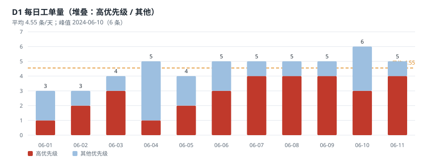
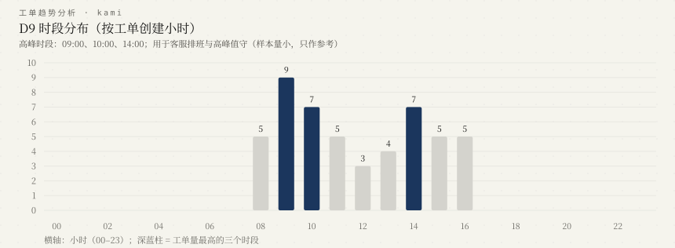
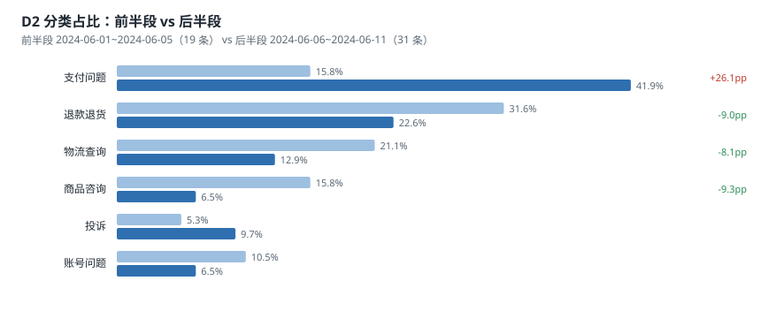
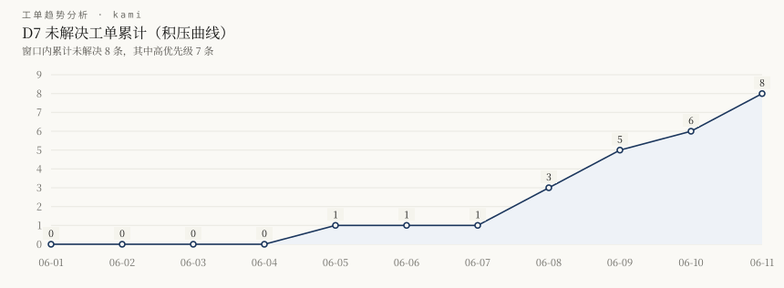
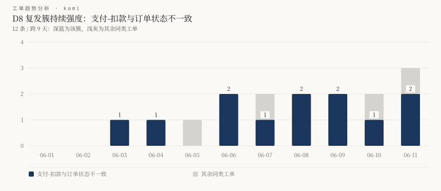
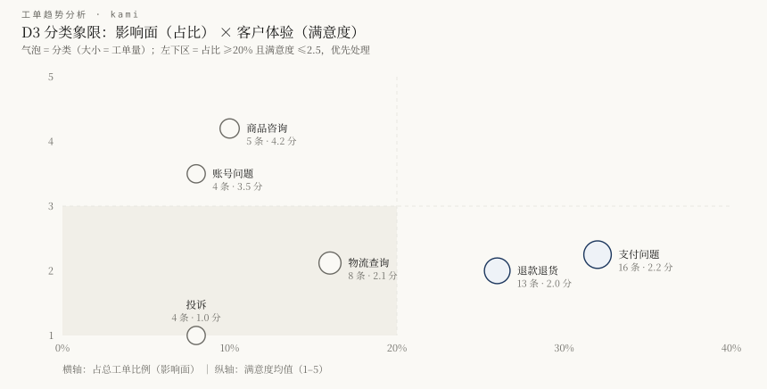

# 客服工单趋势分析报告

> 数据源：`task5_tickets.json` ｜ 时间范围：2024-06-01 ~ 2024-06-11（11 天） ｜ 工单数：50 ｜ 生成时间：2026-09-20 21:46:00 ｜ 工具版本：v1.0.0

## 0. 摘要（先看这里）

1. 量最大的分类是 支付问题（16 条，32.0%），占比从 15.8% 升至 41.9%（+26.1pp）。
2. 最需要当天处理的是「支付问题突增（含复发簇：支付-扣款与订单状态不一致）」：涉及 16 条、跨 9 天、高优占比 100.0%、平均满意度 2.0、频率突增的尾部概率 极小（2.02e-04，<0.1%）。
3. 客户体验最差的是 投诉（满意度均值 1.0，低分率 100.0%）；全局低分率 54.0%，均值 2.4。
4. 处理最慢的是 退款退货（已解决口径均值 30.0h，P90 96h），且未解决 5 条，是最主要的流程堵点。
5. 未解决工单 8 条（高优先级 7 条），SLA 超时 4 条（超时率 9.5%，仅已解决口径），另有 5 条未解决工单挂起时长已超 SLA。
6. 复发簇共识别 10 个，覆盖 38 条工单；未归类 12 条，可能需要补充规则或人工复核。
7. 最近 3 天（06-09、06-10、06-11）日均 5.33 条，此前 3 天（06-06、06-07、06-08）日均 5.0 条，变化 +6.6% → 判定为「稳定」（阈值 ±20%）。
8. 工单级跟进清单：P1 5 条、P2 5 条、P3 13 条（共 23 条，按分值排序，最前面的 T031、T042、T047）；P1/P2 是本工具的跟进优先级，不是企业正式事故等级。

**分级计数**：高危 4 条、关注 7 条、观察 3 条。

## 1. 数据质量与口径

| 检查项 | 结果 |
| --- | --- |
| 工单总数 | 50 条 |
| 时间跨度 | 2024-06-01 ~ 2024-06-11（11 天） |
| 已解决 / 未解决 | 42 / 8 |
| 满意度缺失 | 0 条 |
| 优先级异常值 | 0 处 |

**数据质量告警（工具不会静默处理）**

- 字段说明中列出的渠道 邮件 在实际数据中为 0 条（字段说明与数据不一致）
- 有 8 条未解决工单仍带处理时长（T019、T031、T033、T036、T039…），本工具按“已挂起时长”口径单独统计，不计入 SLA 达成率

> 口径假设：SLA = 高 24h、中 48h、低 72h（假设值，可用 `--sla` 覆盖）；未解决工单的处理时长按“已挂起时长”统计，不计入 SLA 达成率。

## 2. 分析维度

### D1 时间趋势

- 总工单 50 条，日均 4.55 条；峰值日 2024-06-10（6 条）。
- 前半段（2024-06-01 ~ 2024-06-05）19 条（3.8 条/天）；后半段（2024-06-06 ~ 2024-06-11）31 条（5.17 条/天），变化 +36%。
- 波动系数 CV = 0.196（日间波动较小，趋势比噪声明显）

| 日期 | 06-01 | 06-02 | 06-03 | 06-04 | 06-05 | 06-06 | 06-07 | 06-08 | 06-09 | 06-10 | 06-11 |
| --- | --- | --- | --- | --- | --- | --- | --- | --- | --- | --- | --- |
| 工单量 | 3 | 3 | 4 | 5 | 4 | 5 | 5 | 5 | 5 | 6 | 5 |

- **滚动环比（最近 3 天 vs 此前 3 天）**：5.33 条/天 vs 5.0 条/天，变化 +6.6% → 判定「**稳定**」（阈值 ±20%，与常见看板口径一致）。

### D9 时段分布（排班价值）

- 高峰时段：09:00、10:00、14:00；最忙的小时是 09:00。

| 小时 | 00 | 01 | 02 | 03 | 04 | 05 | 06 | 07 | 08 | 09 | 10 | 11 | 12 | 13 | 14 | 15 | 16 | 17 | 18 | 19 | 20 | 21 | 22 | 23 |
| --- | --- | --- | --- | --- | --- | --- | --- | --- | --- | --- | --- | --- | --- | --- | --- | --- | --- | --- | --- | --- | --- | --- | --- | --- |
| 工单量 | 0 | 0 | 0 | 0 | 0 | 0 | 0 | 0 | 5 | 9 | 7 | 5 | 3 | 4 | 7 | 5 | 5 | 0 | 0 | 0 | 0 | 0 | 0 | 0 |

> 用途：把高峰期人力压在对应时段；本数据集只有 11 天、50 条，时段结论只能作为**参考**，需要更长窗口验证。

### D2 分类结构

| 分类 | 条数 | 占比 | 前半段占比 | 后半段占比 | 漂移 |
| --- | ---: | ---: | ---: | ---: | ---: |
| 支付问题 | 16 | 32.0% | 15.8% | 41.9% | +26.1pp |
| 退款退货 | 13 | 26.0% | 31.6% | 22.6% | -9.0pp |
| 物流查询 | 8 | 16.0% | 21.1% | 12.9% | -8.1pp |
| 商品咨询 | 5 | 10.0% | 15.8% | 6.5% | -9.3pp |
| 投诉 | 4 | 8.0% | 5.3% | 9.7% | +4.4pp |
| 账号问题 | 4 | 8.0% | 10.5% | 6.5% | -4.1pp |

**结论**：支付问题 的占比漂移最大（+26.1pp），说明问题结构在窗口内发生了实质变化，而不只是总量波动。

### D3 严重程度

- 高优先级 31 条（62.0%）；前半段 47.4% → 后半段 71.0%。
- 二项尾部校验：以 47.4% 为基线，后半段 31 条中出现 22 条高优先级，尾部概率 0.007（证据强度：中）。

| 分类 | 高优先级条数 | 占比 |
| --- | ---: | ---: |
| 支付问题 | 14 | 87.5% |
| 退款退货 | 7 | 53.8% |
| 物流查询 | 4 | 50.0% |
| 账号问题 | 3 | 75.0% |
| 投诉 | 3 | 75.0% |

### D4 处理效率与 SLA

- 已解决工单平均处理 13.0h，P50 6h，P90 24h；SLA 超时 4 条（9.5%）。
- 另有 **5 条未解决工单的挂起时长已超过 SLA**：T031（120h / SLA 24h）、T047（96h / SLA 24h）、T042（72h / SLA 24h）、T019（36h / SLA 24h）、T039（36h / SLA 24h）。这些不计入上面的超时率，而是体现在积压维度（D7）。

| 分类 | 已解决 | 均值 | P50 | P90 | 最长 | 未解决 |
| --- | ---: | ---: | ---: | ---: | ---: | ---: |
| 支付问题 | 15 | 5.2h | 5h | 8h | 12h | 1 |
| 退款退货 | 8 | 30.0h | 12h | 96h | 96h | 5 |
| 物流查询 | 6 | 18.7h | 8h | 48h | 48h | 2 |
| 商品咨询 | 5 | 0.9h | 1h | 1h | 1h | 0 |
| 账号问题 | 4 | 5.0h | 2h | 12h | 12h | 0 |
| 投诉 | 4 | 23.0h | 12h | 48h | 48h | 0 |

**口径对照（同一份数据、两种口径）**：主口径只统计已解决工单（P50/P90 用 nearest-rank）；全量口径把未解决工单的“已挂起时长”也算进去（P90 用线性插值，与 Excel/numpy 默认一致）。全局：已解决口径均值 13.0h / P50 6h / P90 24h；全量口径均值 **19.7h** / P50 7h / P90 **50h**。两个数都对，差别只来自“未解决的 8 条算不算”。本工具主张用主口径做效率判断（未完成的工作不该算进处理效率），同时给出全量口径，方便与其它看板/工具对齐。

| 分类 | 已解决口径 均值 | 已解决口径 P90 | 全量口径 均值 | 全量口径 P90 |
| --- | ---: | ---: | ---: | ---: |
| 支付问题 | 5.2h | 8h | 5.2h | 8h |
| 退款退货 | 30.0h | 96h | 45.2h | 96h |
| 物流查询 | 18.7h | 48h | 24.5h | 48h |
| 商品咨询 | 0.9h | 1h | 0.9h | 1h |
| 账号问题 | 5.0h | 12h | 5.0h | 10h |
| 投诉 | 23.0h | 48h | 23.0h | 41h |

**SLA 超时工单明细（4 条，按超出时长排序）**

| 工单 | 分类 | 优先级 | 处理时长 | SLA | 超出 |
| --- | --- | --- | ---: | ---: | ---: |
| T007 | 退款退货 | 高 | 96h | 24h | 72h |
| T001 | 退款退货 | 高 | 72h | 24h | 48h |
| T006 | 物流查询 | 高 | 48h | 24h | 24h |
| T024 | 投诉 | 高 | 48h | 24h | 24h |

### D5 客户体验

- 满意度均值 2.4（中位数 2），低分率（≤2 分）54.0%。

| 分类 | 样本 | 满意度均值 | 低分率 |
| --- | ---: | ---: | ---: |
| 支付问题 | 16 | 2.2 | 56.2% |
| 退款退货 | 13 | 2.0 | 61.5% |
| 物流查询 | 8 | 2.1 | 75.0% |
| 商品咨询 | 5 | 4.2 | 0.0% |
| 账号问题 | 4 | 3.5 | 0.0% |
| 投诉 | 4 | 1.0 | 100.0% |

| 处理时长分桶 | 样本 | 满意度均值 |
| --- | ---: | ---: |
| <6h | 20 | 3.4 |
| 6-24h | 20 | 1.9 |
| 24-72h | 7 | 1.4 |
| >72h | 3 | 1.0 |

### D6 渠道结构

| 渠道 | 条数 | 占比 | 平均处理时长（已解决） | 满意度均值 | 低分率 | 未解决 |
| --- | ---: | ---: | ---: | ---: | ---: | ---: |
| 在线 | 34 | 68.0% | 10.9h | 2.6 | 44.1% | 4 |
| 电话 | 16 | 32.0% | 18.2h | 1.9 | 75.0% | 4 |

### D7 积压状态

- 未解决 8 条（16.0%），其中高优先级 7 条。

| 工单 | 分类 | 优先级 | 已挂起(h) | 约等于天数 | 创建日 |
| --- | --- | --- | ---: | ---: | --- |
| T031 | 退款退货 | 高 | 120 | 5.0 | 2024-06-08 |
| T047 | 退款退货 | 高 | 96 | 4.0 | 2024-06-11 |
| T042 | 退款退货 | 高 | 72 | 3.0 | 2024-06-10 |
| T033 | 物流查询 | 中 | 48 | 2.0 | 2024-06-08 |
| T019 | 物流查询 | 高 | 36 | 1.5 | 2024-06-05 |
| T039 | 退款退货 | 高 | 36 | 1.5 | 2024-06-09 |
| T036 | 退款退货 | 高 | 24 | 1.0 | 2024-06-09 |
| T046 | 支付问题 | 高 | 6 | 0.2 | 2024-06-11 |

### D8 关联关系与复发簇

| 簇 | 条数 | 占比 | 跨天数 | 高优占比 | 满意度均值 | 一致性 Jaccard | 相对全库 | 复发词 | 未解决 | 工单号 |
| --- | ---: | ---: | ---: | ---: | ---: | ---: | ---: | ---: | ---: | --- |
| 支付-扣款与订单状态不一致 | 12 | 24.0% | 9 | 100.0% | 2.0 | 0.056 | 6.11× | 2 | 1 | T008、T012、T020、T022、T028、T030、T032、T035、T037、T041、T046、T050 |
| 收货/派送/退件异常 | 4 | 8.0% | 10 | 75.0% | 2.0 | 0.006 | 0.65× | 1 | 1 | T006、T019、T043、T049 |
| 退货运费争议与报销未兑现 | 4 | 8.0% | 7 | 50.0% | 2.0 | 0.086 | 9.38× | 0 | 2 | T011、T021、T031、T042 |
| 客服体验（态度/等待/机器人） | 4 | 8.0% | 8 | 50.0% | 1.2 | 0.038 | 4.14× | 2 | 0 | T010、T026、T034、T044 |
| 物流信息停滞 | 3 | 6.0% | 8 | 33.3% | 2.3 | 0.059 | 6.43× | 0 | 1 | T002、T027、T033 |
| 支付-链路失败与页面异常 | 3 | 6.0% | 7 | 66.7% | 3.0 | 0.015 | 1.64× | 1 | 0 | T016、T025、T048 |
| 退款/退货到账与审核超期 | 3 | 6.0% | 11 | 100.0% | 1.3 | 0.025 | 2.73× | 0 | 1 | T001、T007、T047 |
| 账号与安全风险 | 2 | 4.0% | 4 | 100.0% | 3.0 | 0.036 | 3.92× | 0 | 0 | T029、T045 |
| 售后规则争议（无理由退货/自动确认收货） | 2 | 4.0% | 1 | 100.0% | 1.0 | 0.0 | 0.0× | 0 | 2 | T036、T039 |
| 发货延迟 | 1 | 2.0% | 1 | 0.0% | 2.0 | — | — | 0 | 0 | T013 |

> 文本一致性口径：簇内两两描述字符二元组 Jaccard 相似度均值，全库随机配对基准 0.0092；相对倍数越高说明簇内越像同一类问题（≥2 倍视为同源佐证，不足则标注“一致性偏弱”）。

未归类到任何规则簇的工单 12 条：T003、T004、T005、T009、T014、T015、T017、T018、T023、T024、T038、T040。

## 3. 异常信号清单

### 高危（4 条）

#### A1 · 支付问题突增（含复发簇：支付-扣款与订单状态不一致）

- **信号类型**：分类突增 + 复发簇（S1/S2） ｜ **分值**：6/6 ｜ **分级**：高危
- **证据**：12 条 / 跨 9 天（2024-06-03 ~ 2024-06-11）；高优占比 100.0%；平均满意度 2.0；簇内文本一致性 0.056（全库基准的 6.1 倍）；分类级证据：支付问题 日均 0.6 → 2.17 条/天，占比漂移 +26.1pp
- **判断依据**：簇内 12 条同一规则命中，跨 8 个不同日期；后半段 10 条 / 前半段 2 条，泊松尾部概率 极小（2.02e-04，<0.1%）（证据强度：强）；复发词命中 2 条；簇内相似度是全库随机配对的 6.1 倍（同源佐证）；分类级泊松校验：按前半段基线 0.6 条/天，后半段期望 3.6 条，实际 13 条，尾部概率 极小（1.00e-04，<0.1%）
- **建议动作**：拉取支付流水与订单库做对账核查（回调是否丢失/重复），先处理未解决工单
- **复核方式**：打开原始工单核对描述是否同一根因；若属于不同根因，请补充/拆分规则簇
- **涉及工单**：T008、T012、T020、T022、T028、T030、T032、T035、T037、T041、T046、T050

#### A2 · 效率与体验双差：退款退货

- **信号类型**：效率堵点 + 体验塌陷（S3/S4） ｜ **分值**：6/6 ｜ **分级**：高危
- **证据**：P50 12h / P90 96h / 最长 96h；未解决 5 条；平均满意度 2.0；体验：满意度均值 2.0、低分率 61.5%（13 条评分）
- **判断依据**：已解决工单平均 30.0h ≥ 全局 13.0h 的 1.5 倍；未解决 5/13（38.5%）≥ 全局未解决率 16.0% 的 2 倍且 ≥3 条；该分类占总工单 26.0%，是量级最大的堵点之一；同时满足体验塌陷条件（均值 ≤2.5 且低分率 ≥60%），说明慢与差是同一个问题的两面
- **建议动作**：把该分类的流程改造与体验回访合并推进：先拆链路找卡点，再对低分工单逐条回访
- **复核方式**：抽查 3 条超长工单的实际流转记录，确认卡点在审批、仓储还是支付通道
- **涉及工单**：T001、T007、T031、T036、T039、T042、T047

#### A3 · 体验塌陷：物流查询

- **信号类型**：体验塌陷（S4） ｜ **分值**：6/6 ｜ **分级**：高危
- **证据**：满意度均值 2.1（样本 8），低分率 75.0%
- **判断依据**：均值 ≤2.5 且低分率 ≥60%，属于结果指标恶化；该分类 8 条占总工单 16.0%
- **建议动作**：逐条回访低分工单，定位是响应速度、赔付方案还是态度问题
- **复核方式**：抽取低分样本复核聊天记录，区分个案与系统性问题
- **涉及工单**：T002、T006、T013、T019、T027、T033、T043、T049

#### A4 · 未解决工单积压（高优先级为主）

- **信号类型**：积压累积（S5） ｜ **分值**：6/6 ｜ **分级**：高危
- **证据**：未解决 8 条（16.0%），其中高优先级 7 条；最长挂起 120h（T031，退款退货）
- **判断依据**：未解决 ≥5 条且高优先级占比 ≥50%，属于绝对量事实（不依赖统计推断）
- **建议动作**：当天点名跟进：先处理挂起最久与高优先级叠加的工单，给出明确时限
- **复核方式**：在工单系统中按未解决 + 优先级排序复核清单是否一致
- **涉及工单**：T031、T047、T042、T033、T019、T039、T036、T046

### 关注（7 条）

#### A5 · 复发簇：退款/退货到账与审核超期

- **信号类型**：复发簇（S2） ｜ **分值**：6/6 ｜ **分级**：关注
- **证据**：3 条 / 跨 11 天（2024-06-01 ~ 2024-06-11）；高优占比 100.0%；平均满意度 1.3；簇内文本一致性 0.025（全库基准的 2.7 倍）
- **判断依据**：簇内 3 条同一规则命中，跨 3 个不同日期；后半段 1 条 / 前半段 2 条，泊松尾部概率 0.909（证据强度：弱）；复发词命中 0 条；簇内相似度是全库随机配对的 2.7 倍（同源佐证）
- **建议动作**：梳理退款审核链路，对超过 72h 未到账的工单调专人跟进
- **复核方式**：打开原始工单核对描述是否同一根因；若属于不同根因，请补充/拆分规则簇
- **涉及工单**：T001、T007、T047

#### A6 · 复发簇：客服体验（态度/等待/机器人）

- **信号类型**：复发簇（S2） ｜ **分值**：5/6 ｜ **分级**：关注
- **证据**：4 条 / 跨 8 天（2024-06-03 ~ 2024-06-10）；高优占比 50.0%；平均满意度 1.2；簇内文本一致性 0.038（全库基准的 4.1 倍）
- **判断依据**：簇内 4 条同一规则命中，跨 4 个不同日期；后半段 3 条 / 前半段 1 条，泊松尾部概率 0.121（证据强度：弱）；复发词命中 2 条；簇内相似度是全库随机配对的 4.1 倍（同源佐证）
- **建议动作**：复核机器人的转人工策略与高峰期排班，避免重复描述与长等待
- **复核方式**：打开原始工单核对描述是否同一根因；若属于不同根因，请补充/拆分规则簇
- **涉及工单**：T010、T026、T034、T044

#### A7 · 复发簇：退货运费争议与报销未兑现

- **信号类型**：复发簇（S2） ｜ **分值**：5/6 ｜ **分级**：关注
- **证据**：4 条 / 跨 7 天（2024-06-04 ~ 2024-06-10）；高优占比 50.0%；平均满意度 2.0；簇内文本一致性 0.086（全库基准的 9.4 倍）
- **判断依据**：簇内 4 条同一规则命中，跨 4 个不同日期；后半段 3 条 / 前半段 1 条，泊松尾部概率 0.121（证据强度：弱）；复发词命中 0 条；簇内相似度是全库随机配对的 9.4 倍（同源佐证）
- **建议动作**：明确运费承担规则与垫付报销时效，给客服统一话术与一键登记入口
- **复核方式**：打开原始工单核对描述是否同一根因；若属于不同根因，请补充/拆分规则簇
- **涉及工单**：T011、T021、T031、T042

#### A8 · 复发簇：支付-链路失败与页面异常

- **信号类型**：复发簇（S2） ｜ **分值**：5/6 ｜ **分级**：关注
- **证据**：3 条 / 跨 7 天（2024-06-05 ~ 2024-06-11）；高优占比 66.7%；平均满意度 3.0；簇内文本一致性 0.015（全库基准的 1.6 倍），一致性偏弱，建议人工复核
- **判断依据**：簇内 3 条同一规则命中，跨 3 个不同日期；后半段 2 条 / 前半段 1 条，泊松尾部概率 0.337（证据强度：弱）；复发词命中 1 条；簇内相似度是全库随机配对的 1.6 倍（一致性偏弱）
- **建议动作**：排查支付网关成功率与前端页面异常，确认是否与特定支付方式相关
- **复核方式**：打开原始工单核对描述是否同一根因；若属于不同根因，请补充/拆分规则簇
- **涉及工单**：T016、T025、T048

#### A9 · 复发簇：物流信息停滞

- **信号类型**：复发簇（S2） ｜ **分值**：4/6 ｜ **分级**：关注
- **证据**：3 条 / 跨 8 天（2024-06-01 ~ 2024-06-08）；高优占比 33.3%；平均满意度 2.3；簇内文本一致性 0.059（全库基准的 6.4 倍）
- **判断依据**：簇内 3 条同一规则命中，跨 3 个不同日期；后半段 2 条 / 前半段 1 条，泊松尾部概率 0.337（证据强度：弱）；复发词命中 0 条；簇内相似度是全库随机配对的 6.4 倍（同源佐证）
- **建议动作**：与快递方核对在途异常件，对停滞超 48h 的订单主动补发或说明
- **复核方式**：打开原始工单核对描述是否同一根因；若属于不同根因，请补充/拆分规则簇
- **涉及工单**：T002、T027、T033

#### A10 · 效率与体验双差：投诉

- **信号类型**：效率堵点 + 体验塌陷（S3/S4） ｜ **分值**：6/6 ｜ **分级**：关注
- **证据**：P50 12h / P90 48h / 最长 48h；未解决 0 条；平均满意度 1.0；体验：满意度均值 1.0、低分率 100.0%（4 条评分）
- **判断依据**：已解决工单平均 23.0h ≥ 全局 13.0h 的 1.5 倍；该分类占总工单 8.0%，是量级最大的堵点之一；同时满足体验塌陷条件（均值 ≤2.5 且低分率 ≥60%），说明慢与差是同一个问题的两面
- **建议动作**：把该分类的流程改造与体验回访合并推进：先拆链路找卡点，再对低分工单逐条回访
- **复核方式**：抽查 3 条超长工单的实际流转记录，确认卡点在审批、仓储还是支付通道
- **涉及工单**：T024

#### A11 · 渠道效率差异：电话 慢于 在线

- **信号类型**：渠道差异（S6） ｜ **分值**：3/6 ｜ **分级**：关注
- **证据**：电话 平均处理 18.2h（16 条） vs 在线 10.9h（34 条）；满意度 1.9 vs 2.6，低分率 75.0% vs 44.1%
- **判断依据**：两渠道样本均 ≥5 条且平均时长差异 ≥1.5 倍（18.2h vs 10.9h），说明差异不是单条极值造成的；同时 电话 的低分率更高（75.0% vs 44.1%）
- **建议动作**：检查 电话 的排班与工具支持（如是否能直接操作退款/改单）
- **复核方式**：比较两渠道同类工单（如退款）的处理时长，排除问题结构差异
- **涉及工单**：T004、T006、T010、T012、T017、T019、T022、T027、T029、T031、T035、T039…

### 观察（3 条）

#### A12 · 候选簇（需复核）：收货/派送/退件异常

- **信号类型**：复发簇（S2） ｜ **分值**：6/6 ｜ **分级**：观察
- **证据**：4 条 / 跨 10 天（2024-06-02 ~ 2024-06-11）；高优占比 75.0%；平均满意度 2.0；簇内文本一致性 0.006（全库基准的 0.7 倍），一致性偏弱，建议人工复核
- **判断依据**：簇内 4 条同一规则命中，跨 4 个不同日期；后半段 2 条 / 前半段 2 条，泊松尾部概率 0.692（证据强度：弱）；复发词命中 1 条；簇内相似度是全库随机配对的 0.7 倍（一致性存疑（低于随机配对），已降级为观察）
- **建议动作**：核对签收凭证与派送记录，处理虚假签收与错派，修正地址变更流程
- **复核方式**：打开原始工单核对描述是否同一根因；若属于不同根因，请补充/拆分规则簇
- **涉及工单**：T006、T019、T043、T049

#### A13 · 候选簇（需复核）：售后规则争议（无理由退货/自动确认收货）

- **信号类型**：复发簇（S2） ｜ **分值**：4/6 ｜ **分级**：观察
- **证据**：2 条 / 跨 1 天（2024-06-09 ~ 2024-06-09）；高优占比 100.0%；平均满意度 1.0；簇内文本一致性 0.000，一致性偏弱，建议人工复核
- **判断依据**：簇内 2 条同一规则命中，跨 1 个不同日期；后半段 2 条 / 前半段 0 条，泊松尾部概率 不适用（证据强度：不适用）；复发词命中 0 条；簇内相似度是全库随机配对的 0.0 倍（一致性存疑（低于随机配对），已降级为观察）
- **建议动作**：复核规则配置与话术，明确自动确认收货的异常场景处理流程
- **复核方式**：打开原始工单核对描述是否同一根因；若属于不同根因，请补充/拆分规则簇
- **涉及工单**：T036、T039

#### A14 · 复发簇：账号与安全风险

- **信号类型**：复发簇（S2） ｜ **分值**：4/6 ｜ **分级**：观察
- **证据**：2 条 / 跨 4 天（2024-06-07 ~ 2024-06-10）；高优占比 100.0%；平均满意度 3.0；簇内文本一致性 0.036（全库基准的 3.9 倍）
- **判断依据**：簇内 2 条同一规则命中，跨 2 个不同日期；后半段 2 条 / 前半段 0 条，泊松尾部概率 不适用（证据强度：不适用）；复发词命中 0 条；簇内相似度是全库随机配对的 3.9 倍（同源佐证）
- **建议动作**：按安全事件流程核查登录日志与下单设备，必要时冻结并联系用户
- **复核方式**：打开原始工单核对描述是否同一根因；若属于不同根因，请补充/拆分规则簇
- **涉及工单**：T029、T045

## 4. 工单级优先跟进清单（今天先处理哪几张单）

共 23 条工单进入清单：**P1 5 条、P2 5 条、P3 13 条**。评分规则：未解决 +3；未解决且挂起已超 SLA +1；高优先级 +2（中 +1）；耗时/挂起 ≥ 全量口径 P90（50.4h）+2；满意度 ≤2 +2；命中复发簇 +1。分级：P1 ≥9 分（今天处理）、P2 7–8 分（本周跟进）、P3 5–6 分（备查，仅列工单号）；阈值按本数据集的分数分布标定（8 分与 7 分之间存在明显断层），低于 5 分不进清单。

> **P1/P2/P3 是本工具的跟进优先级，不是企业正式事故等级**，用于排序工作量，不用于对外通报。

| # | 工单 | 等级 | 分值 | 分类 | 优先级 | 状态 | 时长/挂起 | 满意度 | 命中簇 | 命中原因 |
| ---: | --- | --- | ---: | --- | --- | --- | ---: | ---: | --- | --- |
| 1 | T031 | **P1** | 11 | 退款退货 | 高 | 未解决 | 120h | 1 | 退货运费争议与报销未兑现 | 未解决；挂起 120h 已超 SLA 24h；高优先级；耗时 120h ≥ 全量 P90 50.4h；满意度 1 分；命中复发簇：退货运费争议与报销未兑现 |
| 2 | T042 | **P1** | 11 | 退款退货 | 高 | 未解决 | 72h | 1 | 退货运费争议与报销未兑现 | 未解决；挂起 72h 已超 SLA 24h；高优先级；耗时 72h ≥ 全量 P90 50.4h；满意度 1 分；命中复发簇：退货运费争议与报销未兑现 |
| 3 | T047 | **P1** | 11 | 退款退货 | 高 | 未解决 | 96h | 1 | 退款/退货到账与审核超期 | 未解决；挂起 96h 已超 SLA 24h；高优先级；耗时 96h ≥ 全量 P90 50.4h；满意度 1 分；命中复发簇：退款/退货到账与审核超期 |
| 4 | T019 | **P1** | 9 | 物流查询 | 高 | 未解决 | 36h | 1 | 收货/派送/退件异常 | 未解决；挂起 36h 已超 SLA 24h；高优先级；满意度 1 分；命中复发簇：收货/派送/退件异常 |
| 5 | T039 | **P1** | 9 | 退款退货 | 高 | 未解决 | 36h | 1 | 售后规则争议（无理由退货/自动确认收货） | 未解决；挂起 36h 已超 SLA 24h；高优先级；满意度 1 分；命中复发簇：售后规则争议（无理由退货/自动确认收货） |
| 6 | T036 | **P2** | 8 | 退款退货 | 高 | 未解决 | 24h | 1 | 售后规则争议（无理由退货/自动确认收货） | 未解决；高优先级；满意度 1 分；命中复发簇：售后规则争议（无理由退货/自动确认收货） |
| 7 | T046 | **P2** | 8 | 支付问题 | 高 | 未解决 | 6h | 1 | 支付-扣款与订单状态不一致 | 未解决；高优先级；满意度 1 分；命中复发簇：支付-扣款与订单状态不一致 |
| 8 | T001 | **P2** | 7 | 退款退货 | 高 | 已解决 | 72h | 2 | 退款/退货到账与审核超期 | 高优先级；耗时 72h ≥ 全量 P90 50.4h；满意度 2 分；命中复发簇：退款/退货到账与审核超期 |
| 9 | T007 | **P2** | 7 | 退款退货 | 高 | 已解决 | 96h | 1 | 退款/退货到账与审核超期 | 高优先级；耗时 96h ≥ 全量 P90 50.4h；满意度 1 分；命中复发簇：退款/退货到账与审核超期 |
| 10 | T033 | **P2** | 7 | 物流查询 | 中 | 未解决 | 48h | 2 | 物流信息停滞 | 未解决；中优先级；满意度 2 分；命中复发簇：物流信息停滞 |

P3（5–6 分，共 13 条，备查/顺手处理）：T006、T010、T012、T020、T022、T027、T030、T032、T034、T035、T041、T049、T050。

## 5. 方法与阈值

| 信号 | 触发阈值 |
| --- | --- |
| S1 分类突增 | 后半段日均 ≥ 前半段日均 × 2 且后半段 ≥ 5 条 |
| S2 复发簇 | 簇内 ≥ 3 条且跨 ≥ 3 个不同日期（一致性 Jaccard 作为佐证） |
| S3 效率堵点 | 分类平均时长 ≥ 全局 × 1.5，或未解决率 ≥ 全局 × 2 且 ≥ 3 条 |
| S4 体验塌陷 | 满意度均值 ≤ 2.5 且低分率 ≥ 60%（样本 ≥ 3） |
| S5 积压累积 | 未解决 ≥ 5 条且高优先级占比 ≥ 50% |
| S6 渠道差异 | 两渠道样本各 ≥ 5，平均时长差 ≥ 1.5 倍 |

**分级打分**（0–6 分）：影响面（占比 ≥20% =2 / ≥10% =1）、持续（跨 ≥6 天 =2 / ≥2 天 =1）、严重度（高优占比 ≥60% =2 / ≥40% =1）、体验（均值 ≤2.5 或低分率 ≥50% =2 / ≤3.0 =1）。≥5 分 = 高危（要求条数 ≥5 且尾部概率 ≤0.05），3–4 分 = 关注，≤2 分 = 观察。

**辅助概率校验**：泊松尾部概率（分类/簇的频率突增）与二项尾部概率（高优先级占比变化），用于排除明显偶然；详见实现文档 §5.4。

## 6. 局限性与后续建议

1. **样本小**：仅 50 条 / 11 天，且无历史基线，只能做窗口内前后对比，无法区分季节性与事件驱动。
2. **规则簇召回有限**：未归类工单 12 条，其中可能仍有未识别的同源问题；建议业务专家补充同义词后重跑。
3. **SLA 与口径是假设**：超时类结论随 `--sla` 变化；未解决工单时长按“已挂起”解释。
4. **人工录入偏差**：分类与优先级由客服判定，口径漂移会影响趋势判断。
5. **概率校验的边界**：工单存在自相关，泊松/二项仅作辅助证据，不构成显著性结论。

**下一步建议**：① 用支付簇的 12 条工单推动一次对账排查；② 设 72h 退款超时提醒；③ 补齐 90 天历史数据以建立周内基线；④ 让业务补充簇规则同义词后重跑本工具。

## 附录 A · 指标字典

| 指标 | 口径 |
| --- | --- |
| 日均 | 工单数 ÷ 天数（前后半段天数不等，故必须用日均比较） |
| 占比漂移 | 后半段占比 − 前半段占比，单位 pp |
| 分位数 | nearest-rank，小样本不做插值 |
| 低分率 | 满意度 ≤2 的条数 ÷ 有评分条数 |
| SLA 超时 | 处理时长 > SLA 且工单已解决 |
| 挂起时长 | 未解决工单的 resolution_time_hours |
| 簇一致性 | 簇内两两描述字符二元组 Jaccard 相似度均值 |

## 附录 B · 簇规则表（可审计）

| 簇 | 关键词 |
| --- | --- |
| 支付-扣款与订单状态不一致 | 扣了两次、重复扣款、扣了钱、扣钱了、已经扣款、扣款成功、付款成功、支付成功、待支付、未支付、没生成、订单没成功、多扣、扣款金额不对 |
| 支付-链路失败与页面异常 | 支付提示失败、付不了款、一直转圈、结算页面打不开、付款页面 |
| 售后规则争议（无理由退货/自动确认收货） | 自动确认收货、无理由、凭什么、不给退 |
| 退货运费争议与报销未兑现 | 运费、快递费 |
| 退款/退货到账与审核超期 | 还在审核、还在处理、钱还没退、还没退、什么时候退、什么时候给、不想退 |
| 客服体验（态度/等待/机器人） | 机器人、客服态度、问了、等了、人手不够、重新描述 |
| 账号与安全风险 | 冻结、别人用我的账号、不是我操作、被盗 |
| 发货延迟 | 没发货、未发货、发不了货 |
| 物流信息停滞 | 没有物流、任何物流、物流更新、没更新、快递显示异常、物流信息 |
| 收货/派送/退件异常 | 被退回、签收、派送、收货地址、没收到、快递员 |

**多命中工单**（按优先级归入首个簇，其余命中记录在此）

| 工单 | 归入 | 同时命中 |
| --- | --- | --- |
| T033 | logistics_tracking_stuck | logistics_delivery_abnormal |
| T035 | pay_state_mismatch | shipping_delay, logistics_delivery_abnormal |
| T039 | policy_dispute | logistics_delivery_abnormal |
| T041 | pay_state_mismatch | refund_delay |
| T042 | refund_shipping_fee | refund_delay |
